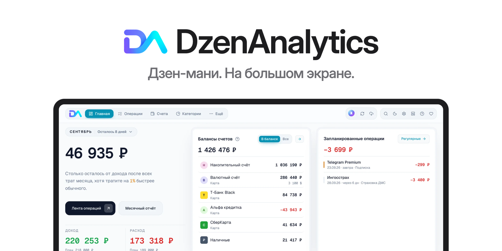

<p align="center">
  <a href="https://dzenanalytics.ru">
    <picture>
      <source media="(prefers-color-scheme: dark)" srcset="docs/assets/banner-dark.png" />
      
    </picture>
  </a>
</p>

<p align="center">
  <b>Спокойная и наглядная аналитика ваших денег из <a href="https://zenmoney.ru/">Дзен-мани</a>.</b><br/>
  Десятки графиков, бюджеты, цели FIRE, финансовое здоровье — и всё это прямо в вашем браузере.
</p>

<p align="center">
  <a href="https://dzenanalytics.ru"><b>🌐 Сайт проекта</b></a> ·
  <a href="https://app.dzenanalytics.ru"><b>🚀 Открыть онлайн</b></a> ·
  <a href="https://t.me/dzenanalytics">Telegram-канал</a> ·
  <a href="CHANGELOG.md">История изменений</a> ·
  <a href="LICENSE">MIT</a>
</p>

---

## Зачем это

Дзен-мани отлично собирает ваши операции. **DzenAnalytics превращает их в понятную картину:**
куда уходят деньги, на чём можно сэкономить и успеваете ли вы к своей цели — без таблиц и ручной возни.

Основная цель DzenAnalytics — предоставить пользователю **удобный и современный веб-инструмент** (в первую очередь для больших экранов — компьютеров и ноутбуков) для работы со своими данными из Дзен-мани, и дать возможность увидеть чуть больше аналитики, чем есть в родительском сервисе.

## Что внутри

- 📊 **Дашборд и графики** — совокупный баланс, потоки доходов и расходов, разбивка по категориям и подкатегориям, тренды и календарь активности.
- 🎯 **Планирование** — бюджеты план/факт, цели и FIRE, правило 50/30/20.
- ❤️ **Финансовое здоровье** — норма сбережений, подушка безопасности, поиск необычных трат и дубликатов.
- ✏️ **Не только просмотр** — операции можно создавать, редактировать и удалять прямо здесь, а изменения по желанию уезжают обратно в Дзен-мани.
- 🔌 **Два источника** — живая синхронизация через API Дзен-мани или офлайн-импорт CSV-выгрузки.

Подробный разбор возможностей — в разделе **«Справка»** внутри приложения.

## Приватность прежде всего

**Данные остаются у вас. Никакой телеметрии.**
Все данные обрабатываются и хранятся только в вашем браузере — даже в онлайн-версии сервер
лишь отдаёт файлы приложения и ваших данных не видит. При работе через API запросы идут
напрямую в Дзен-мани. По умолчанию приложение лишь читает данные — отправка изменений
обратно в Дзен-мани включается вами вручную.

## Как начать

- **Онлайн** — откройте **[app.dzenanalytics.ru](https://app.dzenanalytics.ru)**. Устанавливать ничего не нужно. Сервер только отдаёт файлы приложения: ваши данные хранятся в облаке Дзен-мани и в вашем браузере. Также работает у партнёра: [dzenanalytics.zentable.ru](https://dzenanalytics.zentable.ru).
- **Офлайн** — скачайте standalone-сборку из [релизов](https://github.com/DEADover/DzenAnalytics/releases), распакуйте и откройте `DzenAnalytics.html`. Один файл, работает без интернета (при условии использования CSV-выгрузки).
- **Из исходников:**

  ```bash
  git clone https://github.com/DEADover/DzenAnalytics
  cd DzenAnalytics
  npm install
  npm run dev      # разработка
  npm run build    # сборка в dist/
  ```

- **В Docker** — собственный хостинг одной командой. Готовый образ выходит с каждым релизом (amd64 и arm64) и поднимает приложение в nginx на порту `8000`:

  ```bash
  docker run -d -p 8000:8000 --restart unless-stopped ghcr.io/deadover/dzenanalytics:latest
  # затем откройте http://localhost:8000
  ```

  Вместо `latest` можно закрепить версию: `ghcr.io/deadover/dzenanalytics:1.10.4`. Собрать образ из исходников:

  ```bash
  git clone https://github.com/DEADover/DzenAnalytics
  cd DzenAnalytics
  docker compose -f docker/docker-compose.yaml up -d --build
  # свой порт: LISTEN_PORT=3000 docker compose -f docker/docker-compose.yaml up -d --build
  ```

  Вход через OAuth в готовом образе выключен — адрес провайдера задаётся при сборке. Вход по токену и загрузка CSV работают.

Токен Дзен-мани подключается в самом приложении: **Настройки → Данные → Дзен-мани API**.
Нет токена? Загрузите CSV-выгрузку из Дзен-мани — всё работает офлайн.

## Как получить токен?

Токен нужен только для онлайн-режима (живая синхронизация через API Дзен-мани). Для офлайн-работы с CSV он не требуется.

В онлайн-версии у партнёра можно просто нажать «Войти через Дзен-мани». Для остальных вариантов токен проще всего получить готовым сервисом:

1. Откройте [**zerro.app/token**](https://zerro.app/token) (открытый проект, [исходники на GitHub](https://github.com/ardov/zerro)).
2. Войдите логином от Дзен-мани — откроется стандартное OAuth-окно Дзен-мани.
3. Подтвердите доступ — сервис покажет ваш токен.
4. Скопируйте строку токена и вставьте в приложении: **Настройки → Данные → Дзен-мани API → Подключить и синхронизировать**.

> Токен **выпускает сам Дзен-мани** — zerro.app лишь посредник и не хранит его у себя. В DzenAnalytics токен живёт только в вашем браузере (IndexedDB — встроенная в браузер база данных) и уходит только в сам Дзен-мани.

## Стек

React 19 · TypeScript · Vite · Tailwind CSS.

## ❤️ Отблагодарить автора

Проект делается с любовью в свободное время и остаётся бесплатным. Если он оказался полезным — можно сказать спасибо с помощью донатов (отсканируйте QR или нажмите на него). Кофе нынче дорогой, а недосыпы пагубно влияют на здоровье. ~~Ещё жена сказала, что хочет мужа миллионера.~~

<p align="center">
  <a href="https://pay.cloudtips.ru/p/bbde8948">
    
  </a>
</p>

---

**Лицензия:** [MIT](LICENSE) — свободно используйте, изменяйте и распространяйте.
